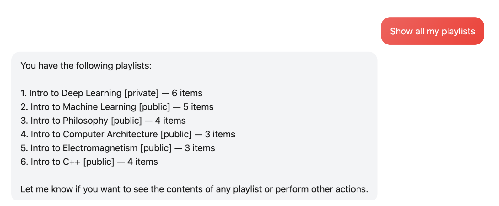

# YouTube MCP Server

A Model Context Protocol (MCP) server that lets AI agents manage YouTube playlists through authenticated MCP tools and prompt templates. Built using the [Alpic MCP Template](https://docs.alpic.com/) with Streamable HTTP transport and Google's official TypeScript SDK.

> **Note:** This project was bootstrapped from Alpic's MCP Template, which provides a solid foundation for building MCP servers with TypeScript and Streamable HTTP transport.

## Features

- **OAuth2-authenticated access** to the YouTube Data API v3 using your own Google account
- **8 MCP Tools** for playlist management (search, create, delete, add/remove videos, inspect playlists)
- **2 MCP Prompts** for higher-level AI tasks (playlist curation, summaries)
- **Web Chat Interface** built with Next.js and Vercel AI SDK
- **Streamable HTTP Transport** for modern MCP client integration
- Designed for use with the MCP Inspector or any MCP-compatible client

## Tech Stack

**Backend (MCP Server)**

- TypeScript + Node.js 22+
- Express 5.x for HTTP server
- `@modelcontextprotocol/sdk` for MCP protocol
- `googleapis` for YouTube Data API v3
- Zod for schema validation
- OAuth2 with Google Cloud

**Frontend (Web Chat)**

- Next.js 14.x (App Router)
- React 18
- Vercel AI SDK (`ai` + `@ai-sdk/openai`)
- CSS Modules for styling

## Prerequisites

- Node.js 22+ (see `.nvmrc` for the recommended version)
- A Google Cloud project with YouTube Data API v3 enabled
- Desktop OAuth client credentials (`credentials.json`) and a generated `token.json` for the YouTube account you want to control

## Setup

1. Install dependencies:

   ```bash
   npm install
   ```

2. Copy the environment template and adjust paths if needed:

   ```bash
   cp .env.example .env
   ```

3. Provide your OAuth credentials so the server can authenticate:

   ```
   config/credentials.json  # Google Cloud OAuth client (desktop app)
   config/token.json        # Generated refresh/access tokens
   ```

   These files are ignored by git. You can also copy their contents into environment variables (see below) and skip mounting files entirely.

4. Run the interactive OAuth flow to populate `token.json`:

   ```bash
   npm run init:token
   ```

   This launches the Google consent screen in your browser (via `@google-cloud/local-auth`). Approve the requested scopes with the YouTube account you want the agent to control; the resulting refresh/access tokens are stored at `config/token.json`.

## Running

- **Development (hot reload):** `npm run dev`
- **Production build:** `npm run build`
- **Start compiled server:** `npm run start`
- **MCP Inspector:** `npm run inspector` (expects the dev server running at `http://localhost:3000/mcp`)

### Web Chat (Next.js)

The `web/` directory hosts a Next.js frontend that connects to this MCP server via the Vercel AI SDK.

```bash
cd web
npm install
npm run dev
```

Configuration lives in `web/.env`. At minimum set `OPENAI_API_KEY` and `MCP_SERVER_URL` (the local server is `http://localhost:3000/mcp`).

## Available MCP Tools

- `searchVideos(query, maxResults?)` – Find videos matching a query.
- `createPlaylist(title, description?, privacyStatus?)` – Create a playlist (private by default).
- `deletePlaylist(playlistId)` – Remove a playlist.
- `addVideoToPlaylist(playlistId, videoId, position?)` – Insert a video into a playlist.
- `addVideosToPlaylist(playlistId, videoIds[], startPosition?)` – Bulk add multiple videos to a playlist.
- `removeVideoFromPlaylist(playlistId, videoId)` – Delete a playlist item by video ID.
- `getMyPlaylists(maxResults?)` – List your playlists.
- `getPlaylistItems(playlistId, maxResults?)` – Inspect videos within a playlist.

Each tool returns structured, human-readable text that you can wire directly into an MCP-aware AI assistant.

## MCP Prompts

- `curatePlaylist(theme, count)` – Provides candidate videos and instructions to craft a themed playlist.
- `summarizePlaylist(playlistId)` – Supplies playlist metadata and videos for natural-language summarization.

These prompts leverage YouTube data so your agent can keep the user in the loop while generating natural responses.

## Example Usage

### Via Web Chat Interface

Try these example prompts in the web interface:

#### Show All My Playlists


#### Curate a Playlist with a Theme

Note: There is a small chance that YouTube can limit the number of playlist creation as it thinks you are a bot, it happened once when I was testing multiple times "create a playlist"


#### Remove a Video from a Playlist


#### Show Items in a Playlist


#### Add a Video to a Playlist


#### Summarize a Playlist


#### Search for Videos


#### YouTube Account Sync Verification


### Via MCP Inspector

1. Start the server: `npm run dev`
2. Run inspector: `npm run inspector`
3. Call tools directly:
   ```json
   {
     "name": "searchVideos",
     "arguments": {
       "query": "Next.js tutorial",
       "maxResults": 5
     }
   }
   ```

## Environment Variables

The server accepts credentials as files, JSON blobs, or individual fields. You only need **one** of these options.

- `MCP_HTTP_PORT` – HTTP server port (default `3000`).
- `YOUTUBE_CREDENTIALS_PATH` / `YOUTUBE_TOKEN_PATH` – File paths for the client and token JSON (default: `config/...`).
- `YOUTUBE_CREDENTIALS_JSON` / `YOUTUBE_TOKEN_JSON` – Inline JSON overrides for the full credential/token objects.
- `YOUTUBE_CLIENT_ID`, `YOUTUBE_CLIENT_SECRET`, `YOUTUBE_REDIRECT_URIS` – Individual credential fields (redirect URIs comma-separated). Takes precedence over the JSON/file options.
- `YOUTUBE_ACCESS_TOKEN`, `YOUTUBE_REFRESH_TOKEN` – Individual token fields. Takes precedence over the JSON/file options.

The `.env.example` file includes placeholders for every option so you can `Import .env` in the Alpic dashboard.

## Inspector Quickstart

1. Start the dev server: `npm run dev`
2. In another terminal, run: `npm run inspector`
3. Use the Inspector UI to invoke any tool or prompt (e.g., call `searchVideos` with a query or run the `summarizePlaylist` prompt with a playlist ID).

## Deployment

### MCP Server (Alpic)

The MCP server can be deployed to Alpic or any Node.js hosting platform:

```bash
# Deploy to Alpic
alpic login
alpic deploy
```

Make sure to configure environment variables in your deployment platform (see `.env.example` for all options).

### Frontend (Vercel)

The web chat interface is designed for Vercel deployment:

```bash
# Push to GitHub
git push origin main

# Deploy via Vercel CLI or connect your GitHub repo in Vercel dashboard
vercel --prod
```

**Required Environment Variables in Vercel:**

- `OPENAI_API_KEY` – Your OpenAI API key
- `MCP_SERVER_URL` – Your deployed MCP server URL (e.g., `https://your-server.alpic.dev/mcp`)
- `OPENAI_MODEL` – (Optional) Model to use, defaults to `gpt-4-turbo`

## OAuth Architecture & Limitations

### Single-Account OAuth Approach

This implementation uses a **single YouTube account** approach:

- OAuth credentials (`credentials.json`) and tokens (`token.json`) are configured once for **one YouTube account**
- All users of the web interface interact with **the same YouTube account**
- The MCP server authenticates as this single account for all operations

### Why This Approach?

✅ **Simpler setup** – No need for user authentication/database
✅ **Perfect for personal use** – Manage your own playlists via AI
✅ **Good for demos** – Show evaluators how the system works

### Security Notes

⚠️ **Current Setup:**

- Your YouTube credentials are in environment variables or config files
- Anyone with access to the deployed frontend uses YOUR OpenAI API key
- Tool calls modify YOUR YouTube account's playlists

## Resources

- [Model Context Protocol Documentation](https://modelcontextprotocol.io/)
- [MCP SDK Documentation](https://github.com/modelcontextprotocol/typescript-sdk)
- [YouTube Data API v3](https://developers.google.com/youtube/v3)
- [Vercel AI SDK Documentation](https://sdk.vercel.ai/docs)
- [Google Cloud Console](https://console.cloud.google.com/)

## License

MIT
